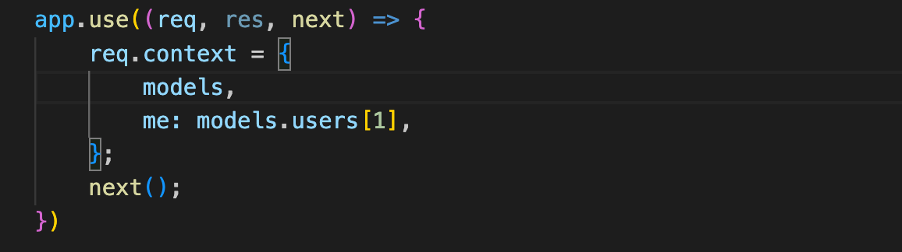
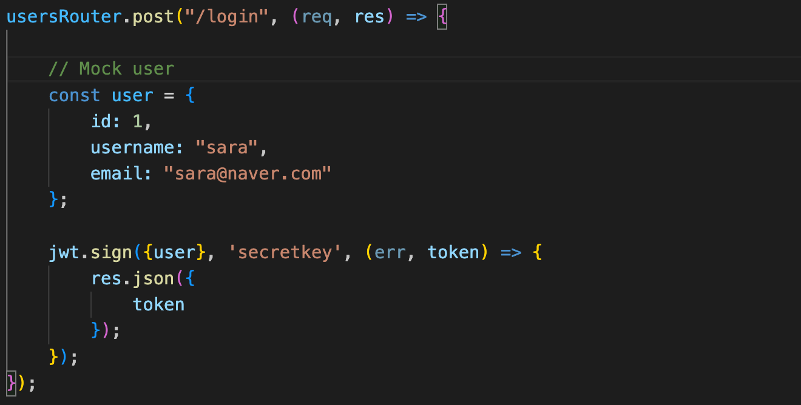
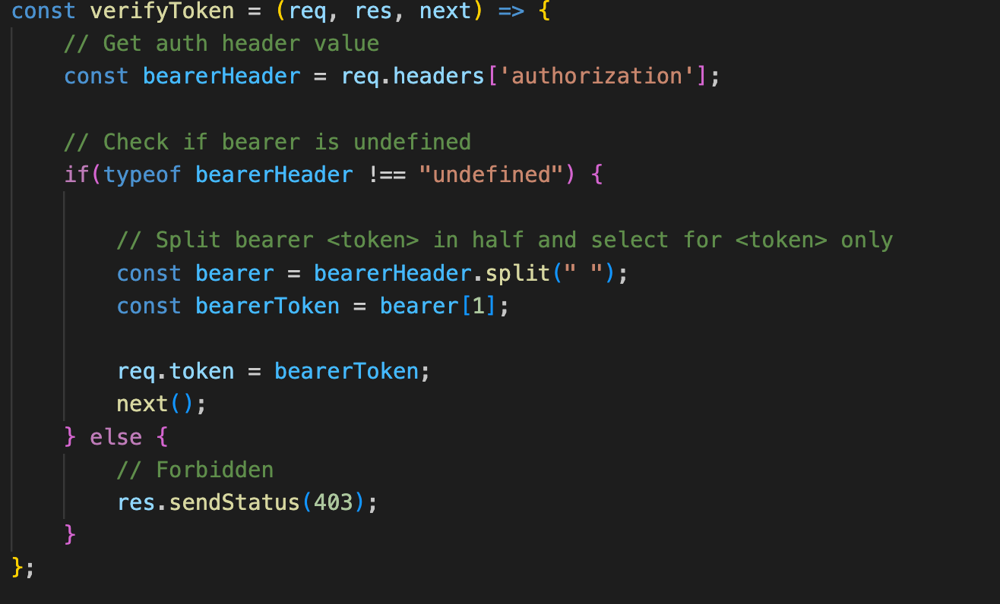
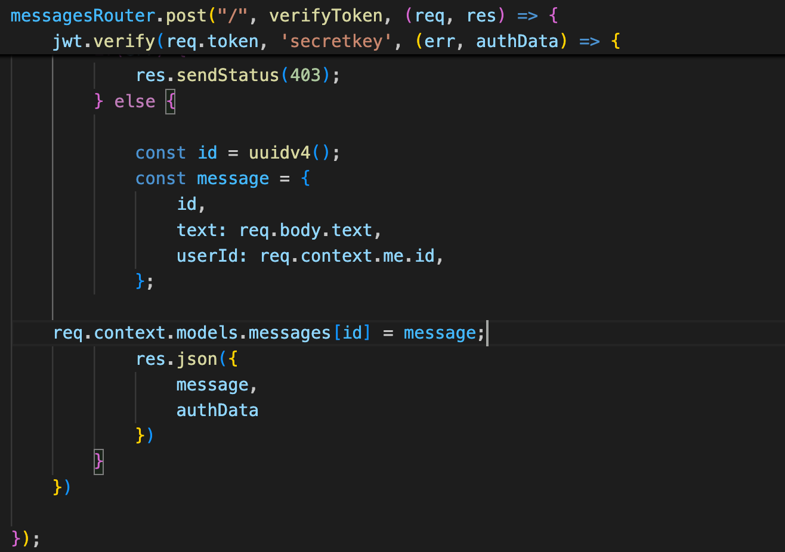

# Restful API Basics

This was a simple practice by doing project to get familiar with Restful API concepts, and working with a seperate backend server from the client frontend.

This project was largely based off the following [article](https://www.robinwieruch.de/node-express-server-rest-api/)

## Mocking Incoming User Tokens

RESTful API architecture leverages the HTTP protocol to enable communication between a client and a server application using structured data. In this project, I utilize JSON. 

Assuming that a user would be authenticated (logged in) with a session token - in this project I also mocked that with the following function where models refers to the data.js file which stores some mock users and messages data. 



This allows the server to remain stateless in this simple project, and we can store relevant session data using req.context which will be referenced in our HTTP methods in the relevant routes.

This middleware function is applied BEFORE any other routes in our app, ensuring that req.context is ALWAYS defined which allows all route logic to parse that data. 

## Adding on Authentification Token

The following logic was implemented based on this [video reference](https://www.youtube.com/watch?v=7nafaH9SddU)

Next, I mocked a user authentification on the users/login route. Normally, a user would enter a login form and submit a post request with their email and password and then our server would use passport and our database to authenticate the user. 

For simplicity, I mocked a user who has already been authenticated with the following function which generates a token for that user.



Then I created the following verify token middleware function which stores the current token data to req.token



So, going forward whenever we need to verify a user, we can check this token, which I implemented on the POST /messages route - where we need to authenticate a user before they post a new message



## Setting up

Fork a clone of this repository then install all dependencies using the command
```
npm install
```

Then you can use homebrew to install curl with the command
```
brew install curl
```

Open a terminal and run the following command to run node
```
node --watch app.js
```

### Using curl to test HTTP Methods

Then open another terminal and you can execute curl commands to mimic routes

To run a standard get request run the http address:
```
curl http://localhost:3000
```

In order to run a PUT, POST or DELETE request you can override the GET default with -X and the HTTP method. For example for a delete request:

```
curl -X DELETE http://localhost:3000/messages/1
```

